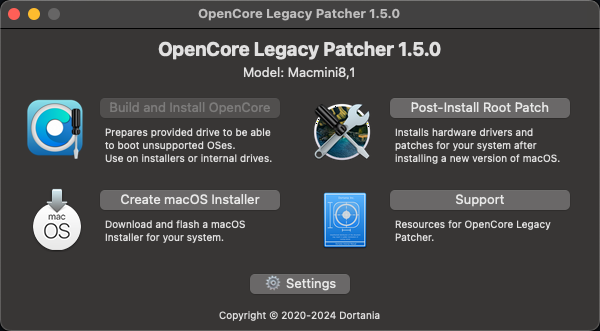

# ASUS_Chromebox3_Sonoma14.6.1_EFI
华硕chromebox3+博通BCM网卡的macOS Sonoma 14.6.1 EFI

该EFI在14.6.1的环境下已经实现大部分功能，具体未实现功能可参考哦国光大佬的文档，主要为自带声卡部分。    
本项目所用网卡为`BCM4360CS2`，类似型号可参考使用。

## 1. 使用该EFI之前请先使用国光大佬的EFI完成系统安装  
https://github.com/sqlsec/Asus-ChromeBox-i7-8550U  
安装前需要将 EFI/OC/config.plist 中的Misc→Security→SecureBootModel 设为 Disabled

## 2. 在macOS安装完成之后，实际系统使用EFI替换为本项目

## 3. 进入系统前需在pe或其他系统环境修改三码配置
默认三码配置我已经更为如下图所示，若未修改将无法进入系统

修改教程参考：
https://www.kejixz.com/1050.html

## 4. 打入驱动补丁
https://github.com/dortania/OpenCore-Legacy-Patcher/releases  
下载AutoPkg-Assets.pkg，点击 Post-intall Root Patch  
安装完成之后，重启即可使用博通网卡


# 文档参考
https://github.com/sqlsec/Asus-ChromeBox-i7-8550U
https://github.com/jingkunchen/Chromebox3-Sonoma-Hackintosh
https://github.com/LostKningc/ASUS_Chromebox3_Sonoma_EFI
https://bbs.pcbeta.com/viewthread-2011654-1-2.html
  
    
      
       
        

         

# 其他
此为个人安装黑苹果时的记录，供参考

## 1.	更换BIos & 接触写入锁
https://www.sqlsec.com/2023/07/macbox.html  
按文章步骤，安装macOS
macOS Sonoma 14.6.1   
安装U盘EFI使用 https://github.com/sqlsec/Asus-ChromeBox-i7-8550U/releases 中的早期版本  
安装前需要将 EFI/OC/config.plist 中的Misc->Security->SecureBootModel 设为 Disabled  
实际系统EFI使用 https://github.com/jingkunchen/Chromebox3-Sonoma-Hackintosh  
其中讲 EFI/OC/kext/AirportItlwm.kext 原装intel网卡驱动替换为https://github.com/OpenIntelWireless/itlwm/releases/tag/v2.3.0 的AirportItlwm_v2.3.0_stable_Sonoma14.4.kext.zip  

## 2.	更换三码洗白
参考文章 https://www.kejixz.com/1050.html  
三码生成软件Hackintool，已在网盘内。记得进行序列号验证  
替换三码 EFI/OC/config.plist 中搜索 Serial，可以跳到对应位置  


## 3.	修复系统卡顿、多核性能问题
修改为999


可考虑购买相关硬盘


## 4.	关闭鼠标加速度
在终端中输入以下指令：  
```bash
defaults write .GlobalPreferences com.apple.mouse.scaling -1
```

## 5.	解决中文输入法卡死问题
打开crontab编辑器：  
```bash
crontab -e
```
请注意crontab的默认编辑器是VIM。VIM的基本用法可以自行搜索。
输入任务(每2小时执行一次)：
```bash
0 */4 * * * kill `pgrep SCIM`
```

关闭spotlight索引
```bash
sudo mdutil -a -i off
```

配置文件参数解读https://apple.sqlsec.com/4-OC%E9%85%8D%E7%BD%AE/4-1.html  
其他服务修复参考文档  
https://dortania.github.io/OpenCore-Post-Install/universal/iservices.html#cleaning-up-your-appleid  

## 6.	Sonoma驱动博通网卡
文档链接https://bbs.pcbeta.com/viewthread-2011654-1-2.html  
文档内文件下载链接  
通过网盘分享的文件：BCM94360CD.zip  
链接: https://pan.baidu.com/s/1nwOC0q6KSFPXEa1mg5TWRg 提取码: fhcx   
通过网盘分享的文件：OpenCore Configurator.zip  
链接: https://pan.baidu.com/s/1kpl4xv9xo-3SIT1AoQ8VTQ 提取码: 95d6 通过网盘分享的文件：OpenCore-Patcher.pkg-1.6.0-1614-20240725.zip  
链接: https://pan.baidu.com/s/1ei32ToSbguooG1XueuTa9g 提取码: im5m   

## 7.	网卡网速过慢问题修复
导入该驱动，驱动参数加入brcmfx-country=HK  

## 8.	个人EFI文件，记得改三码


